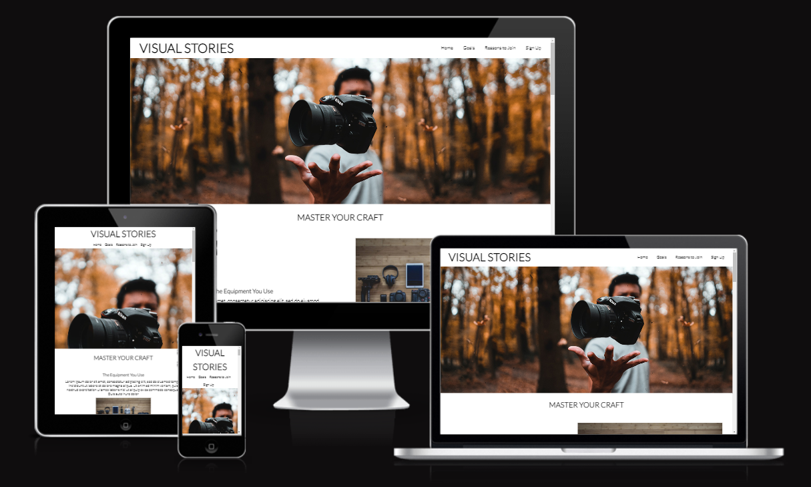
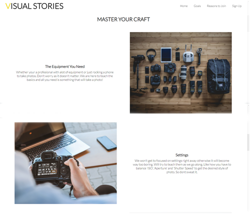
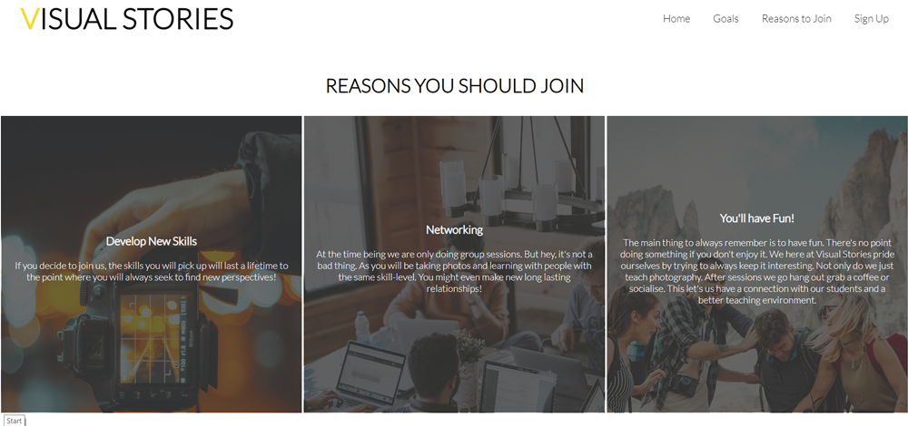
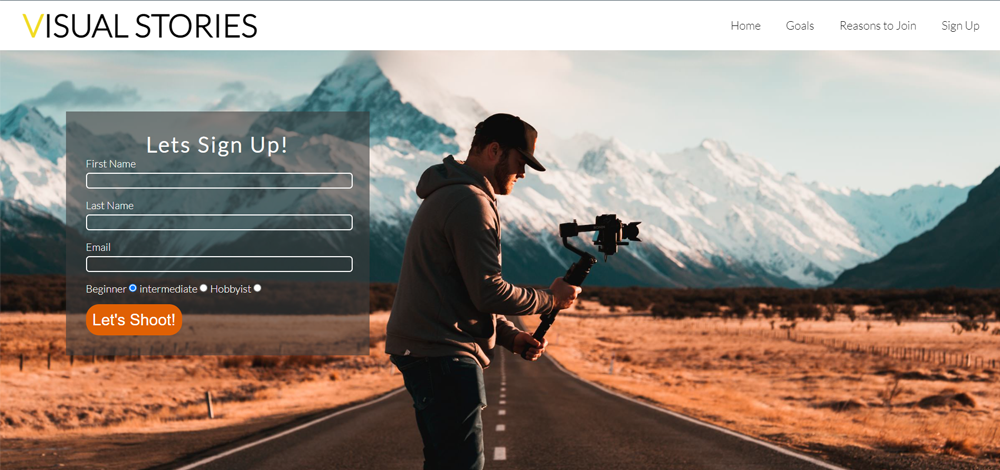
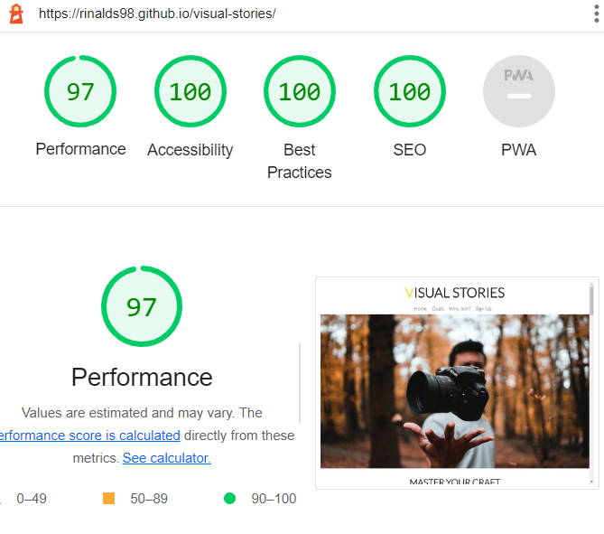

Visual Stories
=

Introduction
=

Visual Studies is a landing page for people from all ages who are interested in doing a photography course.
Visual Studies offers photography workshops for beginners and intermiadiate levels including people who do it as a hobby.
The site is targeted to anoyone who is interested in learning how to take photos.

Users of this website will be able to find everything they need to know about this workshop. For example: what we teach, workshop meet up times and a sign up form. 

Features
=

- Navigation bar
    - since the website takes the form of a single scroll page I decided that I should make the navigation bar sticky. By doing so it makes it easy to navigate more efficienty around the website. 

- Master Your Craft (What you do in the workshop)
    - This section of the website is designed to show you what the workshop is about. The styling used including the use of images has been designed in stylistic way to keep the user interested in reading the section.

- Reasons To Join
    - Keeping with the simplicity of thw website, 3 sections with 3 different points

- Sign Up Form
    - This section will allow users to get signed up for the photography workshop. They will be asked to submit their full name and email address. The user can also specify the skill level they have in photography ie. Beginner, Intermiadiate or hobbyist.

- Footer
    - At the very end of the website we have the footer with links to all relevent social media sites. These links are great for the workshop as they show the user that there is a community online. 
    - This wil encourage them to check out in further detail what it's like doing the workshop.

Testing
=

## Bugs

- Solved Bugs
    - When I first deployed the website I tested it on a couple of devices. One of them was on a iphone. I quickly realised the 'Avif' file format was not loading correctly on IOS so I decided to switch all images to 'jpg'.

## Validator Testing

- I tested my website on multiple browsers including: Chrome, Firefox and Safari (IOS).
    - I also tested it on multiple devices including: Laptop, Samsung S20 Ultra (Android 12), Iphone 13 Pro Max (IOS 15)

- HTML
    - No errors were returned when passing through the official W3C Validator.
- CSS
    - No Errors were found when passing through the official (Jigsaw) validator.
- Accessibility (Lighthouse)
    - I confirmed that the colors and fonts chosen are easy to read and accesible by running it through lighthouse in Google Devtools. But I noticed my performance was significantly lower than expected. This was due to images being too large.

## Unfixed Bugs

No unfixed bugs

Deployment
=
The site was deployed to GitHub pages. The steps to deploy are as follows:
- In the GitHub repository, navigate to Settings tab and on the left side menu click 'Pages'
- Select 'Deploy From Branch' and from the 'branch' option select 'Main' and click 'Save'
- Once it has been saved. A link will be provided to access the completed Website.

The live link can be found here [Visual Stories](https://rinalds98.github.io/visual-stories/ "Visual Stories").

Credits
=
## **Content**
- The icons in the footer were taken from [fontawesome.com](https://fontawesome.com/ "fontawesome.com").
## **Media**
- All images were taken from [unsplash.com](https://unsplash.com/ "unsplash.com").
    - https://unsplash.com/photos/WxM465oM4j4

    - https://unsplash.com/photos/x0rJ-rzX7S8

    - https://unsplash.com/photos/3S60HJk-c6o

    - https://unsplash.com/photos/MChSQHxGZrQ

    - https://unsplash.com/photos/UmV2wr-Vbq8

    - https://unsplash.com/photos/Da0pdCekeUs

    - https://unsplash.com/photos/p8kaVRe4edM

    - https://unsplash.com/photos/iCtJF-A5hvs

    - https://unsplash.com/photos/CnVWM7rIM-E

    - https://unsplash.com/photos/qWYvQMIJyfE 
