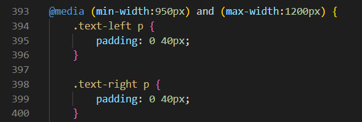

Visual Stories
=

Introduction
=

Visual Stories is a landing page for people of all ages who are interested in doing a photography course.
Visual Stories offers photography workshops for beginners and intermediate levels including people who do it as a hobby.
The site is targeted at anyone interested in learning how to take photos.

Users of this website will be able to find everything they need to know about this workshop. For example: what we teach, workshop meet-up times, and a sign-up form. 

User Experience
=
## **User Stories**
- ## **As a website owner I want that:**

    1. The website provides clear and concise information about the photography workshop and what things it teaches.
    2. The website allows the user to sign up for the workshop and select what level of skill they are in photography.
------

- ## **As a website user I want:**
    1. To easily understand what the website is about.
    2. To learn what the photography course is about.
    3. The times that the course is on.
    4. To easily sign up for the course.
 ------

- ## **As a returning website user I want:**
    1. To be able to check the course timetable quickly.

# 1. Strategy

- The main purpose of this website is to provide information about a photography workshop.
- With this website people with an interest in photography can quickly find out what the workshop is about and join it creating business.

# 2. Scope
- After multiple design choices; a single-page layout was chosen to keep the information simple and clear.
- It has been designed with mobile devices in mind so most smartphones and tablets can access and use the website.

# 3. Structure
- The single-page website has a sticky nav bar which makes it intuitive and easy to jump between sections quickly.
- For desktop view, the logo is on the left, and 4 navigation items on the right create a standard website design for ease of navigation.
- For mobile and tablet views the logo has been centered and the navigation items moved just below the logo to keep the design mobile-friendly.
- The first section 'master your craft' briefly touches on the different things that the user will be learning.
- The 'reasons to join' section lays out in simple terms some of the benefits of joining the workshop.
- The 'workshop schedule' section gives users clear and concise information about what days and times the workshop are open.
- The 'sign up' section has a simple form with radio buttons asking what skill the user is at.
- The 'footer' section provides quick links to the workshop's social media platforms where the user can follow the business. 

# 4. Skeleton
## **Wireframes**
- The initial designs were made as Wireframes using 'Balsamiq'.

# 5. Surface
 - ## **Color**
    - The color theme is based on orange and teal design. The images have been picked with the main color being orange and a slight hint of teal.
    - The sign-up form button and text input border were #e06004 (shade of orange) to reflect a similar orange used in the images.
    - the color scheme used for this website was 'Orange and Teal' which are complimentary colors. They achieve a look that goes well together and contrasts well.

 - ## **Font**
    - The font 'Lato' was used throughout the website and was imported from Google Fonts.
 - ## **Favicon**
    - The favicon I opted to use was the first letter of the website name which consequently is also the logo. I chose the color '#f1db23' (a shade of yellow) to keep the design the same.

Features
=

- ## **Navigation Bar**
    - since the website takes the form of a single scroll page I decided that I should make the navigation bar sticky. Doing so makes it easy to navigate more efficiently around the website. 

- ## **Master Your Craft**
    - This section of the website is designed to show you what the workshop is about. The styling used including the use of images has been designed in a stylistic way to keep the user interested in reading the section.

- ## **Reasons To Join**
    - Keeping with the simplicity of the website, 3 sections with 3 different points

- ## **Sign Up Form**

    - The following details are mandatory for using this form:
        1. First Name
        2. Last Name
        3. Email
        4. Choosing a radio button stating what skill level the user is; ie. Beginner, Intermediate, or hobbyist.

    - When the mouse hovers over the submit button it changes color from orange to white. likewise, the border of the text boxes also changes from orange to white.

-   ## **Footer**
    - At the very end of the website we have a footer with links to all relevant social media sites. These links are great for the workshop as they show the user that there is a community online. 
    - This will encourage them to check out in further detail what it's like doing the workshop.

Testing
=

## **Solved Bugs**
- When I first deployed the website I tested it on a couple of devices. One of them was on an iPhone. I quickly realized the 'Avif' file format was not loading correctly on IOS (Version 15) so I decided to switch all images to 'jpg'.

## **Unfixed Bugs**
- No unfixed bugs

## **Validator Testing**

- **Testing**
    - I tested my website on multiple browsers including Chrome, Firefox, and Safari (IOS).
    - I also tested it on multiple devices including Laptop, Samsung S20 Ultra (Android 12), iPhone 13 Pro Max (IOS 15)

- **HTML**
    - No errors were returned when passing through the official W3C Validator.
    

- **CSS**
    - No Errors were found when passing through the official (Jigsaw) validator.
    

- **Accessibility (Lighthouse)**
    - I confirmed that the colors and fonts chosen are easy to read and accessible by running it through lighthouse in Google Devtools.
    

Deployment
=

**The site was deployed to GitHub pages. The steps to deploy are as follows:**
- In the GitHub repository, navigate to the Settings tab and on the left side menu click 'Pages'
- Select 'Deploy From Branch' and from the 'branch' option select 'Main' and click 'Save'
- Once it has been saved. A link will be provided to access the completed Website.

The live link can be found here [Visual Stories](https://rinalds98.github.io/visual-stories/ "Visual Stories").

Technologies Used
=

- ## Languages
    - HTML5
    - CSS3

- ## Misc. Software
    - [Google Fonts](https://fonts.google.com/ "googlefonts") - 'Lato' was used through out the website.
    - [Font Awesome](https://fontawesome.com/ "fontawesome") - Icons used for social media were taken from Font Awesome.
    - [Favicon](https://Favicon.io/ "Favicon") - Favicon used to convert 'PNG' into a favicon 'ICO' format.
    - [Balsamiq](https://Balsamiq.com/ "Balsamiq") - Wireframes (sketches) were created using Balsamiq.

Credits
=

## **Content**
- The icons in the footer were taken from [fontawesome.com](https://fontawesome.com/ "fontawesome.com").
- For mobile responsiveness, I went to stack overflow to find how to get CSS to work between specific widths
    - https://stackoverflow.com/questions/14008781/media-queries-in-between-two-widths
    
- [Favicon](https://Favicon.io/ "Favicon") - Favicon used to convert 'PNG' into a favicon 'ICO' format.
- [amiresponsive](https://ui.dev/amiresponsive "amiresponsive") - amiresponsive was used to generate a responsive website image used in the README.md file. 

## **Media**

- All images were taken from [unsplash.com](https://unsplash.com/ "unsplash.com").

    - https://unsplash.com/photos/WxM465oM4j4

    - https://unsplash.com/photos/x0rJ-rzX7S8

    - https://unsplash.com/photos/3S60HJk-c6o

    - https://unsplash.com/photos/MChSQHxGZrQ

    - https://unsplash.com/photos/UmV2wr-Vbq8

    - https://unsplash.com/photos/Da0pdCekeUs

    - https://unsplash.com/photos/p8kaVRe4edM

    - https://unsplash.com/photos/iCtJF-A5hvs

    - https://unsplash.com/photos/CnVWM7rIM-E

    - https://unsplash.com/photos/qWYvQMIJyfE 
